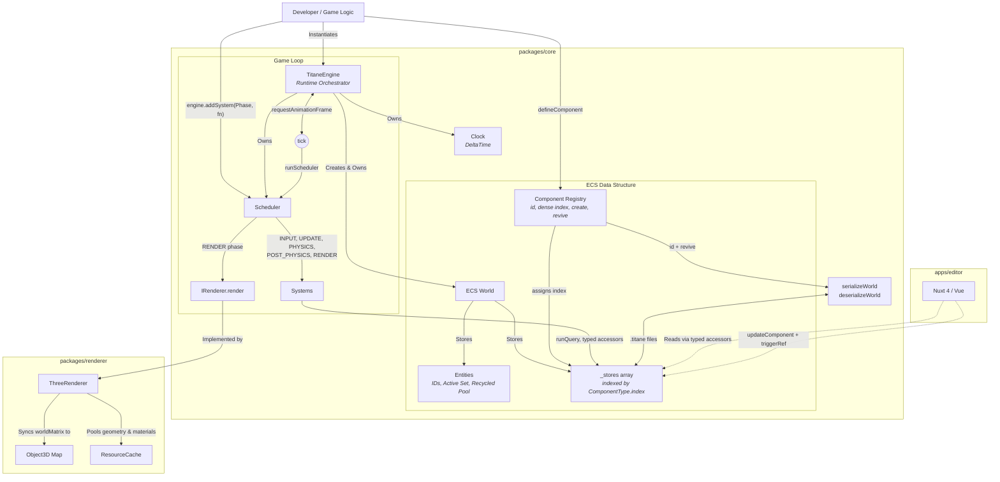

# Titane Engine - Architecture Specification

## 1. Vision & Philosophy
Titane is a high-performance, **Data-Oriented** 3D game engine for the web.
It follows a strict **Entity-Component-System (ECS)** pattern to ensure maximum decoupling between data, logic, and rendering.

### Core Principles
- **Data over Objects:** Components are pure data structures (Interfaces/Types), not classes with logic.
- **Composition over Inheritance:** Game logic is built by combining components, not by extending base classes.
- **Logic over Data:** Systems handle all logic and transformations by iterating over filtered sets of entities.
- **Typed by construction:** A component's data type travels with its handle. No generic argument, no cast, no runtime type registry lookup on the hot path.
- **No gameplay in the engine:** The core ships generic systems only. Anything opinionated is opt-in.

---

## 2. Monorepo Structure
- `packages/core`: the engine. ECS kernel, execution pipeline, standard components, built-in systems, scene serialization and runtime orchestrator. Depends on no graphics library.
- `packages/renderer`: the Three.js driver implementing `IRenderer`. The only package that imports `three`.
- `apps/editor`: Nuxt 4 application. Visualizes the ECS World and allows real-time data editing.

The dependency arrow points one way only: the renderer depends on the core, never the reverse.
Swapping to WebGPU, a headless driver or a canvas 2D debug view means adding a package next to
`packages/renderer`, with nothing to change in the core.

### Dependency Graph & Core Engine Flow


---

## 3. ECS Specification

### Entity
An **Entity** is a unique `number` (ID). It is a mere container/label for components.
IDs of destroyed entities are recycled through a free pool, which is part of the saved scene so a
reload allocates exactly like the session that wrote it.

Two invariants keep the hierarchy consistent:

- **No entity outlives its parent.** `destroyEntity` removes the whole subtree, so no survivor can
  point at a dead ID. An orphan would still be rendered by the transform pass while being
  unreachable from the hierarchy tree.
- **A recycled ID inherits nothing.** Because descendants die with their parent, reusing a freed ID
  can never make it adopt the previous owner's children.

### Component
A **Component** is a pure data object, declared once through `defineComponent`:

```typescript
export interface Velocity { x: number; y: number; z: number }

export const createVelocity = (x = 0, y = 0, z = 0): Velocity => ({ x, y, z });

export const Velocity = defineComponent<Velocity>('velocity', createVelocity);
```

The returned `ComponentType<T>` is the only key the accessors accept. It carries:

| Field | Purpose |
| --- | --- |
| `id` | Stable string identifier, used by serialization and debugging. |
| `index` | Dense slot number. Stores are resolved by array offset, not string hashing. |
| `create` | Factory producing a fresh instance with default values. |
| `revive` | Optional rebuilder for data JSON cannot represent (typed arrays, etc.). |

Declaring the interface and the handle under the same name is intentional: `Velocity` resolves to
the data type in type position and to the handle in value position, so a single import covers both.

Components must NOT contain any methods or logic.

### System
A **System** is a logic unit that runs every frame.
- Signature: `(world: World, deltaTime: number) => void`.
- Queries the world for component combinations and updates their data.
- Registered into a `Phase`, and executed in registration order within that phase.

### Query
A **Query** is declared once at module scope and reused every frame. `runQuery` recycles its
internal buffers, so iterating entities allocates nothing:

```typescript
const movingQuery = defineQuery([Transform, Velocity]);

export const integrateVelocitySystem = (world: World, deltaTime: number): void => {
    for (const entity of runQuery(world, movingQuery)) { /* ... */ }
};
```

`runQuery` iterates the *smallest* matching store first, so the number of membership checks is bound
by the rarest component rather than the largest one. The returned array is owned by the query and is
only valid until the next `runQuery` call on it. For one-off filtering (editor tooling, tests),
`queryEntities` returns a freshly allocated array instead.

### World
The **World** owns all state:
- `entities`: the id counter, the active set and the recycled pool.
- `_stores`: component storage, one `Map<Entity, unknown>` per component slot.

A `TitaneEngine` keeps the same `World` object for its whole lifetime. Loading a scene or restoring a
snapshot copies data **in place**, so the input driver, the renderer and the editor UI never end up
holding a reference to a dead world.

---

## 4. Execution Flow (The Loop)
Every frame, `runScheduler` executes phases in this fixed order:

1. **INPUT:** gather keyboard/mouse/gamepad.
2. **UPDATE:** gameplay logic (AI, triggers, player control).
3. **PHYSICS:** movement and collision.
4. **POST_PHYSICS:** input impulse cleanup, then the transform hierarchy pass.
5. **RENDER:** synchronize the driver and issue the draw call.

The order comes from the `PHASE_ORDER` array, never from object key ordering.

Two phases behave specially in editor mode. When `engine.isPaused` is true, gameplay systems are
skipped but the **transform hierarchy still runs**, so inspector edits are reflected in world
matrices, and **rendering still runs**, so the viewport stays responsive.

---

## 5. Public API Guidelines

| Action | API |
| --- | --- |
| Declare a component | `defineComponent<T>(id, create, revive?)` |
| Create an entity | `createEntity(world)` |
| Destroy an entity and its subtree | `destroyEntity(world, entity)` |
| Duplicate an entity and its subtree | `cloneEntity(world, entity)` |
| Spawn a renderable | `createPrimitive(world, { name, primitive, color, position })` |
| Add data | `addComponent(world, entity, Type, data)` |
| Read data | `getComponent(world, entity, Type)` |
| Test presence | `hasComponent(world, entity, Type)` |
| Remove data | `removeComponent(world, entity, Type)` |
| Mutate data | `updateComponent(world, entity, Type, draft => { ... })` |
| Declare a filter | `defineQuery([TypeA, TypeB])` |
| Run a filter | `runQuery(world, query)` |
| Add logic | `engine.addSystem(Phase.UPDATE, mySystem)` |
| Parent entities | `setParent(world, child, parent)` |
| List children | `getChildren(world, parent)` |
| Save / load a scene | `serializeWorld(world)` / `deserializeWorld(data)` |
| Swap the live scene | `engine.loadWorld(world)` |
| Checkpoint / revert | `engine.saveSnapshot()` / `engine.restoreSnapshot()` |
| Advance one frame | `engine.tick()` |

`World._stores` is internal. Every mutation must go through the functions above.

---

## 6. Renderer Integration Strategy
The `Renderer` is a driver behind the `IRenderer` interface, invoked in the RENDER phase:

1. It maintains a **Map<Entity, RenderedEntity>**, each record holding the `Object3D` plus the
   primitive and color it was last built from.
2. Each frame it runs its own query for `[Transform, Mesh]`.
3. Entities that disappeared from the result have their object removed from the scene and unmapped.
4. New entities get an `Object3D` created and added to the scene.
5. Records whose primitive or color no longer match the live component get their geometry or
   material swapped. Two string comparisons per entity is how a data-oriented driver notices an
   inspector edit without the ECS emitting a single event.
6. Every object has `Transform.worldMatrix` copied straight into `Object3D.matrix`, with
   `matrixAutoUpdate = false`: the ECS is the single source of truth for spatial data.

### Resource pooling
A geometry is fully determined by its primitive type, and a material by its color, so `ResourceCache`
keeps one instance of each and hands it to every entity asking for it. An entity therefore costs a
single `Object3D` rather than its own geometry and material pair, and disposal happens once, when the
renderer shuts down, instead of per entity removal. This is also the groundwork for instancing:
entities already share the exact objects a draw call would need to batch.

### What does not belong on `IRenderer`
Editor chrome. `setGridVisible` lives on `ThreeRenderer` alone, and the editor reaches it by keeping
a reference to the driver it constructed. The engine contract describes rendering a world, not the
helpers a particular tool draws around it.

---

## 7. Editor Communication
The Nuxt editor talks to the engine through the same public API as any game:
- **Editor -> Engine:** the UI mutates data through `updateComponent`, then flags the entity dirty.
- **Engine -> Editor:** the editor holds the engine's `active` entity `Set` in a `shallowRef` and
  calls `triggerRef` after structural changes. There is no deep reactive proxy over engine state,
  which keeps the simulation free of Vue overhead.

---

## 8. Scene Format
Scenes are JSON documents (`.titane`) carrying a `version` field:

```json
{
  "version": 1,
  "nextId": 3,
  "entities": [0, 1, 2],
  "recycled": [],
  "components": {
    "name":      { "1": { "value": "Demo Cube" } },
    "transform": { "1": { "position": { "x": 0, "y": 3, "z": 0 }, "parent": null } }
  }
}
```

Component slots are anonymous on disk: the registry maps `id` back to `index` at load time.
Each component type revives its own data, so the loader contains no per-component special casing.
A scene written by a newer format version is rejected rather than silently misread.
