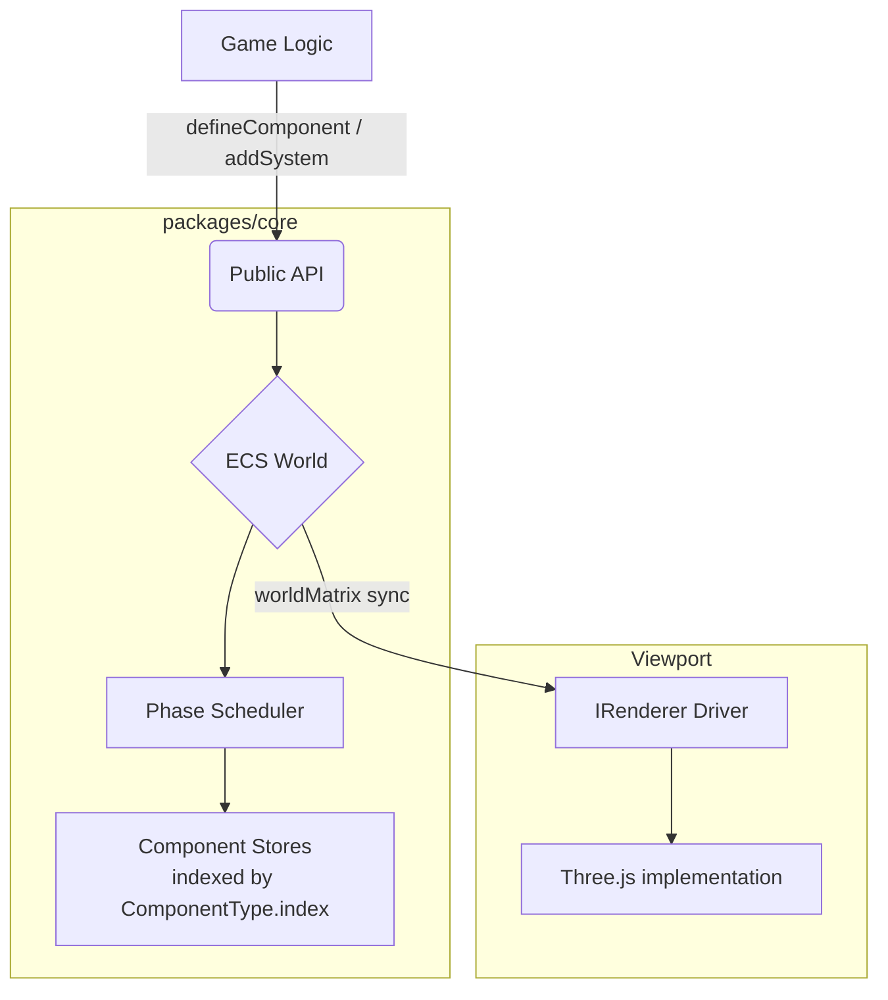

# Titane Engine

**Titane** is a data-oriented 3D engine (ECS) designed for high-performance web. It strictly separates business logic, visual rendering, and world state to provide production stability and scalability.

---

## Philosophy & Vision

3D development on the web often suffers from coupling that is too tight between visual objects and game logic. **Titane** solves this problem by applying three fundamental principles:

1.  **Single Source of Truth (ECS)**: All world state resides in a system of pure Entities and Components. No hidden data in rendering objects.
2.  **Rendering Agnosticism**: The engine's core is a "logical fortress". It communicates with the graphics API through interchangeable **Drivers**.
3.  **Typed by construction**: A component's data type travels with its handle, so the public API needs no generic arguments and no casts. If it compiles, the shapes line up.

---

## Quick Start

```typescript
import {
  TitaneEngine, ThreeRenderer, Phase,
  defineComponent, defineQuery, runQuery,
  createPrimitive, getComponent, addComponent,
  Transform, Velocity, createVelocity
} from '@titane/core';

const engine = new TitaneEngine(new ThreeRenderer(), canvas);

// 1. Spawn something visible
const player = createPrimitive(engine.world, { name: 'Player', position: { x: 0, y: 5, z: 0 } });
addComponent(engine.world, player, Velocity, createVelocity(0, -2, 0));

// 2. Declare your own component
interface Health { current: number }
const Health = defineComponent<Health>('health', () => ({ current: 100 }));
addComponent(engine.world, player, Health, { current: 100 });

// 3. Declare a query once, reuse it every frame (zero allocation)
const damageable = defineQuery([Transform, Health]);

// 4. Register your system into a lifecycle phase
engine.addSystem(Phase.UPDATE, (world, deltaTime) => {
  for (const entity of runQuery(world, damageable)) {
    const transform = getComponent(world, entity, Transform); // Transform | undefined
    const health = getComponent(world, entity, Health);       // Health | undefined
    if (!transform || !health) continue;

    if (transform.position.y < 0) health.current -= 10 * deltaTime;
  }
});

engine.isPaused = false;
engine.start();
```

`getComponent(world, entity, Health)` returns `Health | undefined`. There is no generic argument to
pass and no cast to write, because the handle returned by `defineComponent` carries the type. Asking
for the wrong component is a compile error rather than a silent `undefined` at runtime.

---

## Roadmap

| Phase | Focus | Key Objective | Status |
| :--- | :--- | :--- | :--- |
| **1. Foundations** | ECS Core | Stable kernel, phase scheduler, Three.js driver, versioned scene format. | Done |
| **2. Typed Core** | Public API | `defineComponent` handles, zero-allocation queries, open system registration. | Done |
| **3. Elite Editor** | Visual Tooling | Hierarchy, dynamic Inspector, live sync. | Done |
| **4. Renderer Split** | Decoupling | Extract `packages/renderer`, primitive support, geometry sharing. | Next |
| **5. Interaction** | Viewport | Raycast selection, orbit camera, transform gizmos. | Planned |
| **6. Simulation** | Physics | Rapier (WASM) in the PHYSICS phase, fixed timestep. | Planned |
| **7. Scale** | Storage | Archetype / SoA buffers, cached queries. | Planned |

See [PROJECT_STATUS.md](PROJECT_STATUS.md) for the detailed task breakdown.

---

## Architecture & Structure

- `packages/core` — the engine: ECS kernel, execution pipeline, standard components, built-in systems, scene serialization, runtime orchestrator, Three.js driver.
- `apps/editor` — the Nuxt 4 editor UI.

For an in-depth look at the internal data flow, ECS definitions and the engine loop, read the [Architecture Specification](ARCHITECTURE.md).



> **Note:** the Three.js driver currently lives inside `packages/core`, so `three` is a direct
> dependency of the core. Extracting it into `packages/renderer` is the next milestone.

## Useful Commands

```bash
# Run the editor with HMR
npm run editor:dev

# Compile the core engine in watch mode
npm run core:dev

# Quality gates
npm test          # Vitest suite on the core
npm run typecheck # tsc on the core, vue-tsc on the editor
npm run lint      # ESLint on the editor
```

The editor consumes the core's build output, so keep `npm run core:dev` running alongside
`npm run editor:dev`, or run `npm run core:build` once beforehand.

## Framework Agnostic

Although Titane's official editor is powered by Nuxt 4, the engine itself is an independent
TypeScript library. Nothing in `packages/core` imports Vue, so the runtime drops into Vanilla
TS, React, Svelte or anything else. Titane does not impose a UI framework upon you; it simply
powers your 3D world.

## Tech Stack

- **Core Engine**: TypeScript (Data-Oriented Design), strict mode, no `any`
- **Architecture**: ECS with a deterministic phase scheduler
- **Renderer**: Driver-based (Default: Three.js)
- **Editor**: Nuxt 4 + Nuxt UI
- **Tests**: Vitest
- **Physics**: Rapier (WASM) — declared, not yet integrated
